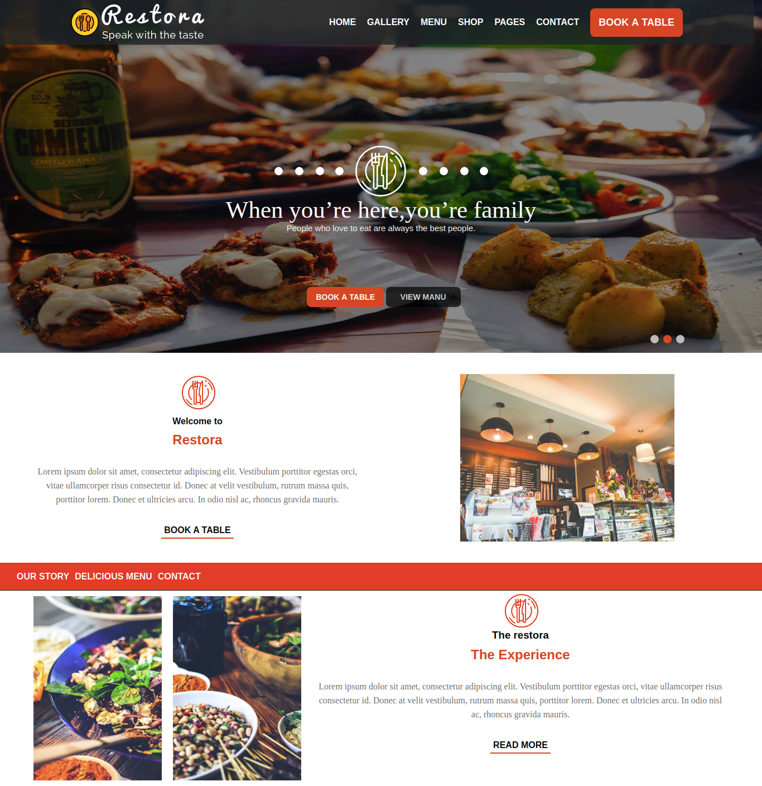

# restaurant-page
> An Odin Project for learning ES6, webpack and DOM manipulation

## Built With
* Vanilla JavaScript
* Webpack, Eslint, CSS

## Live Demo
[Project Demo](https://#)

## Run Locally
To get a local copy up and running follow these simple example steps.

> Clone project to your local machine
```bash
git clone https://github.com/Abdusaid10/restaurant-page/
cd restaurant-page
```
> Install dependencies
```bash
npm install
```
> Build project
```bash
npm build
```
> Run Locally
```bash
npm start
```
## Author

-[Abdusaid Abdurasulov](https://github.com/Abdusaid10)

## Contributing
Contributions, issues and feature requests are welcome!

Feel free to check the issues page.
## Links
[Address, Email and social media icons](http://svgicons.sparkk.fr/)

[Logo icon](https://www.flaticon.com/free-icon/dish_857718)

[Phone icon](https://iconmonstr.com/phone-7-svg/)

[Inspiration for the design of the page](http://theme.innovatory.in/restora/)

[Webpack configuration](https://webpack.js.org/guides/getting-started/)
## License
This project is [MIT](https://github.com/Abdusaid10/restaurant-page/blob/master/LICENSE) licensed.